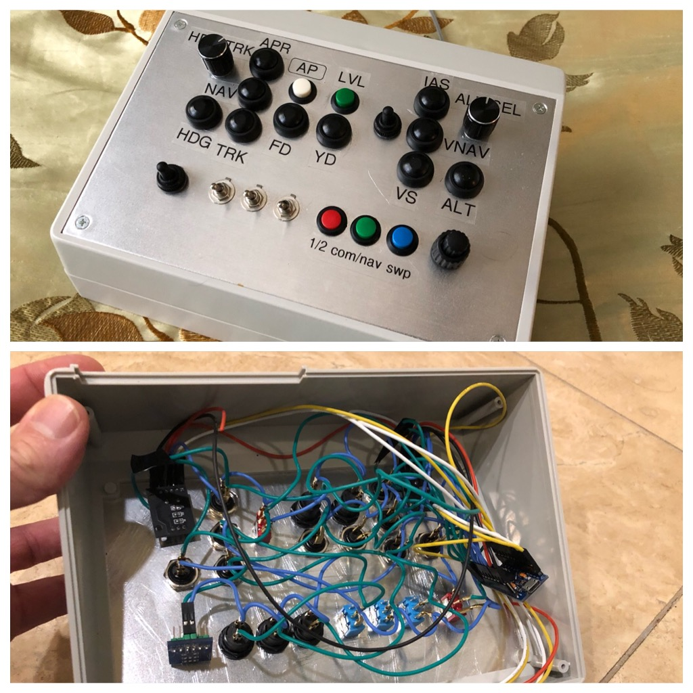

# 32-FUNCTION-BUTTON-BOX

This is a fork of AM-STUDIO's button box.
This version has been updated to
- mix and match half-step and full-step rotary encoders.
- asynchronous joystick updates drops fewer clicks on the rotaries.
- rotary twists are "counted" and the async update keeps them ticking.

in this implementation I made a controller to use with FS2020.
Keep in mind it just looks like a joystick to the PC, so you have
to map the buttons in FS2020 settings.
 

their notes below:
-----------------------------------

View YouTube Video here for setup instructions
https://youtu.be/Z7Sc4MJ8RPM

Please consider supporting 
https://www.patreon.com/AMSTUDIO

Share the video. 

NON-COMMERCIAL PERSONAL USE ONLY COPYRIGHT AMSTUDIO 2018

This work is licensed under a Creative Commons Attribution-NonCommercial-NoDerivatives 4.0 International License.
https://creativecommons.org/licenses/by-nc-nd/4.0/
